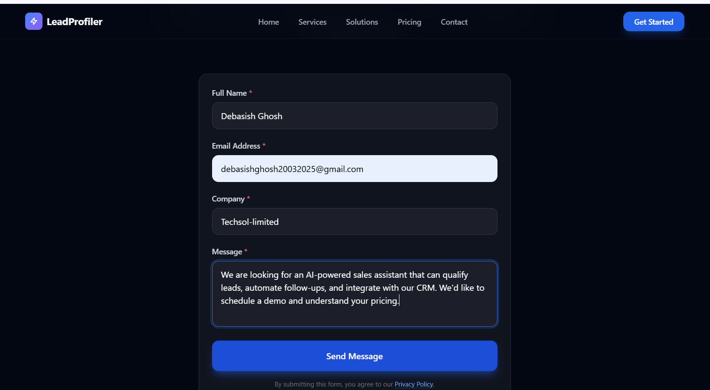
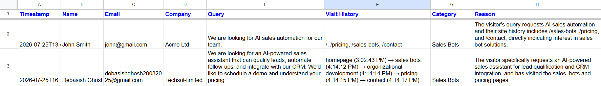
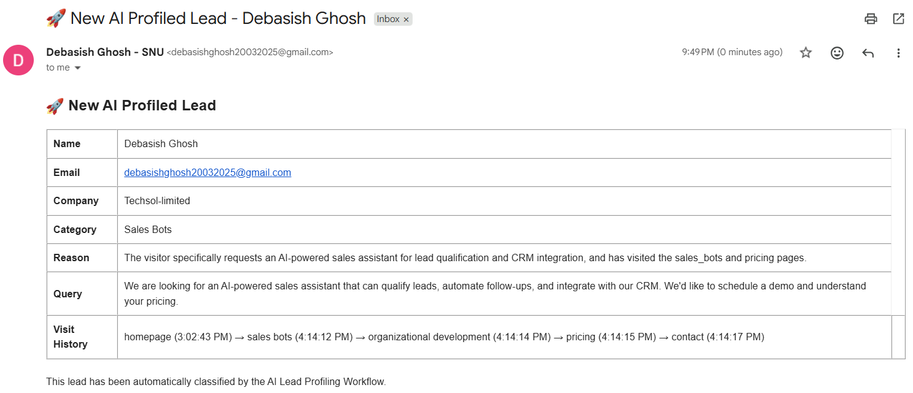
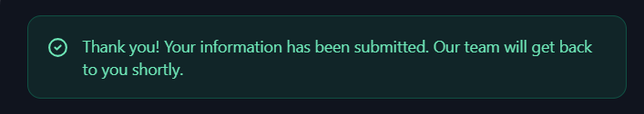
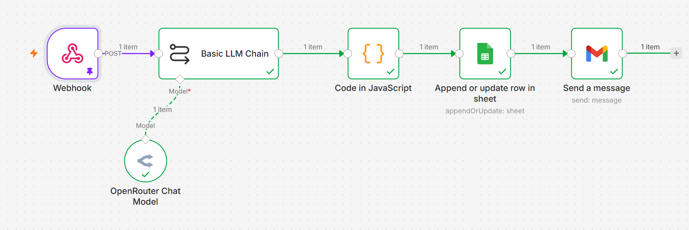

<div align="center">

# AI Lead Profiling System

**Automatically classify website visitors into qualified leads using AI — no manual sorting required.**

[](https://react.dev)
[](https://vite.dev)
[](https://tailwindcss.com)
[](https://n8n.io)
[](./LICENSE)

</div>

---

## How It Works

A visitor fills out the contact form. The system sends their information plus browsing history to an n8n workflow. OpenRouter's LLM analyzes the data, classifies the lead into **Sales Bots** or **Organizational Development**, stores the result in Google Sheets, and emails the sales team — all in seconds.

```text
Visitor submits form
        │
        ▼
React Frontend ──POST──▶ n8n Webhook
                              │
                              ▼
                    LLM Classification
                     (OpenRouter)
                              │
                              ▼
                    ┌─────────┴─────────┐
                    ▼                   ▼
             Google Sheets          Gmail
            (Store Lead)      (Notify Sales)
```

---

## Screenshots

| Lead Form | AI Classification | Email Notification |
|:---------:|:-----------------:|:------------------:|
|  |  |  |

| Message Capture | Workflow Execution |
|:---------------:|:------------------:|
|  |  |

---

## Tech Stack

| Layer | Technology |
|-------|-----------|
| Frontend | React 19, Vite 8, Tailwind CSS 4 |
| Automation | n8n workflow engine |
| AI | OpenRouter (GPT OSS / DeepSeek / Gemma) |
| CRM | Google Sheets |
| Notifications | Gmail |

---

## Project Structure

```text
ai-lead-profiling-system/
├── frontend/                    # React application
│   ├── src/
│   │   ├── components/
│   │   │   ├── layout/          # Header, Footer
│   │   │   ├── sections/        # Hero, Services, HowItWorks, Pricing, Contact
│   │   │   └── ui/              # Button, Input, Card, Alert, FadeIn, etc.
│   │   ├── hooks/               # useContactForm, useVisitHistory, useWebhook, useInView
│   │   ├── services/            # webhook.js — POST to n8n
│   │   └── utils/               # validation, storage, helpers
│   ├── .env.example
│   └── package.json
├── workflow/                    # n8n workflow JSON (importable)
├── screenshots/                 # Application screenshots
├── .env.example
├── PROJECT_SPEC.md              # Functional requirements
├── ARCHITECTURE.md              # System design
├── API.md                       # Webhook payload spec
├── WORKFLOW.md                  # n8n node breakdown
└── SETUP.md                     # Quick start guide
```

---

## Getting Started

### Prerequisites

- **Node.js** 18+
- **npm**
- **Docker** (for n8n)

### 1. Frontend

```bash
cd frontend
npm install
cp .env.example .env
npm run dev
```

Opens at **http://localhost:5173**

### 2. n8n Workflow

```bash
docker start n8n
```

Import `workflow/Lead Profiling Workflow.json` into n8n, then activate it.

### 3. End-to-End Test

1. Open the frontend in your browser
2. Navigate through pages (tracking records each visit)
3. Fill out and submit the contact form
4. Check Google Sheets for the new lead row
5. Check Gmail for the notification email

---

## Environment Variables

| Variable | Description | Default |
|----------|-------------|---------|
| `VITE_N8N_WEBHOOK_URL` | n8n webhook endpoint | `http://localhost:5678/webhook/lead-profile` |

---

## Frontend Architecture

### Component Hierarchy

```text
App
├── Header              (nav, mobile menu, smooth scroll)
├── Hero                (CTA, stats)
├── Services            (Sales Bots, Org Development cards)
├── HowItWorks          (4-step flow)
├── Pricing             (3-tier cards)
├── Contact             (validated form → webhook)
└── Footer
```

### Key Hooks

| Hook | Purpose |
|------|---------|
| `useVisitHistory` | Reads/writes page visits to localStorage, prevents duplicates |
| `useWebhook` | Manages loading/error/success states for form submission |
| `useContactForm` | Form state, field-level validation, submit status |
| `useInView` | IntersectionObserver-based scroll animations |

### Webhook Payload

```json
{
  "name": "Jane Doe",
  "email": "jane@example.com",
  "company": "Example Corp",
  "query": "We need a sales bot for our e-commerce site",
  "visit_history": [
    { "page": "homepage", "timestamp": "2025-01-15T10:30:00.000Z" },
    { "page": "sales_bots", "timestamp": "2025-01-15T10:30:05.000Z" },
    { "page": "pricing", "timestamp": "2025-01-15T10:30:12.000Z" }
  ]
}
```

---

## n8n Workflow Nodes

| # | Node | Description |
|---|------|-------------|
| 1 | **Webhook** | Receives the POST payload from the frontend |
| 2 | **LLM Chain** | Sends visitor data to OpenRouter for classification |
| 3 | **Code** | Parses the AI JSON response |
| 4 | **Google Sheets** | Stores the qualified lead |
| 5 | **Gmail** | Sends notification to the sales team |

---

## Available Scripts

```bash
npm run dev      # Start development server
npm run build    # Production build
npm run preview  # Preview production build
npm run lint     # Run oxlint
```

---

## License

MIT
